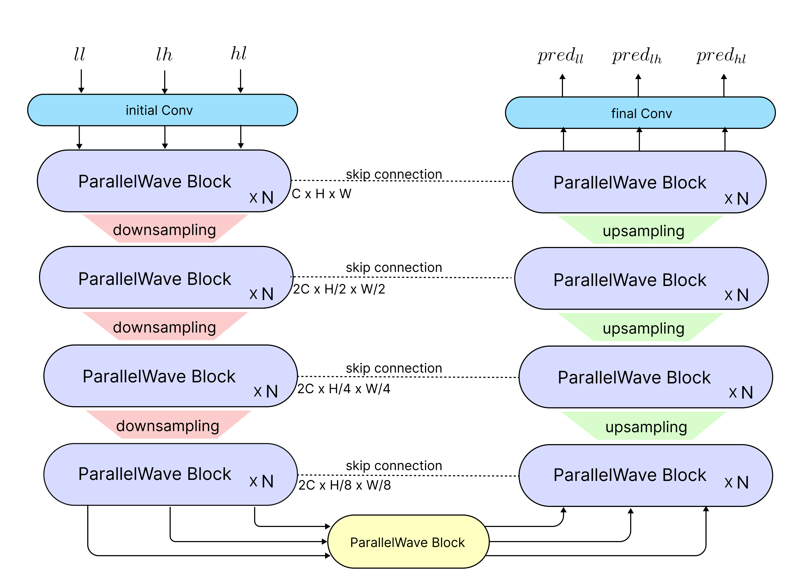
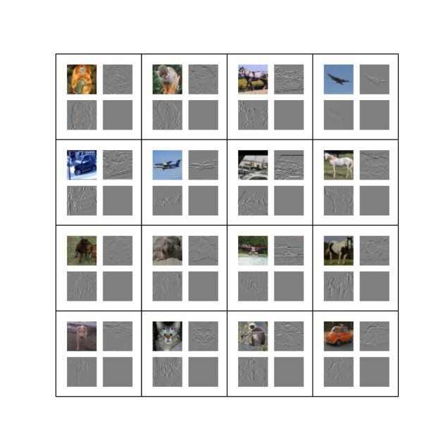
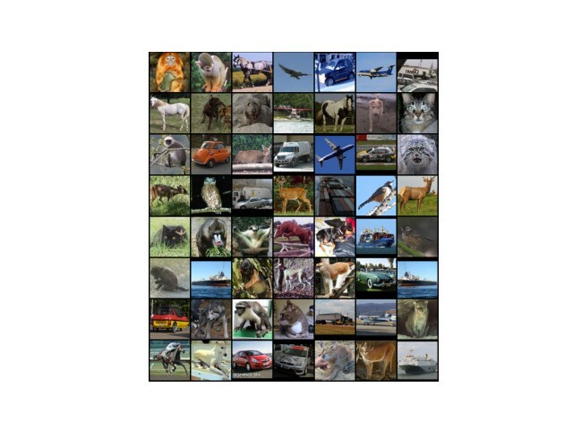

# MultiSpectral Diffusion: joint generation of wavelet coefficients for image synthesis and upsampling
This is the official PyTorch implementation of the paper [MultiSpectral Diffusion: joint generation of wavelet coefficients for image synthesis and upsampling]
(https://doi.org/10.1007/s11042-024-20383-9), which is accepted by multimedia tools and applications 2024

## Contents
- [MultiSpectral Diffusion: joint generation of wavelet coefficients for image synthesis and upsampling](#multispectral-diffusion-joint-generation-of-wavelet-coefficients-for-image-synthesis-and-upsampling)
  - [Contents](#contents)
  - [Introduction](#introduction)
    - [Overview](#overview)
    - [Visual](#visual)
  - [Requirements and Dependencies](#requirements-and-dependencies)
  - [Models](#models)
  - [Dataset](#dataset)
  - [Test](#test)
  - [Train](#train)
  - [Conditional Generation](#conditional-generation)
  - [Acknowledgement](#acknowledgement)
  - [Citation](#citation)
  - [Contact](#contact)
  
## Introduction
We addressed the challenges of convergence and computational demands in
diffusion models for image generation by leveraging wavelet transformation. Our method
involves decomposing images into different frequency components, each with its own distri-
butional characteristics. The wavelet domain enables more controlled generation of frequency
components, mitigating the inherent difficulties that generative models face in recovering
high-frequency details, which complicate the training process. We achieve high quality samples in term of FID and up to a 23% reduction in floating point operations (FLOPs) compared with the vanilla DDPM on STL-10 (64x64) dataset.

### Overview



### Visual
The generated wavelet coeffcients on STL-10:


The generated images on STL-10:



## Requirements and Dependencies
* python 3.10 
* PyTorch 2.1.2  
* CUDA 12.1  

```
git clone https://github.com/ImanGoudarzvand/MultiSpectral-Diffusion.git

cd MultiSpectral-Diffusion


pip install -r requirement.txt
```

## Models

Pre-trained model (LF) can be downloaded from [google drive](https://drive.google.com/file/d/1ixZrJ6Dmjki_efSHb3ECW0iAQlmqV5Ut/view?usp=drive_link)

Pre-trained model (HF) can be downloaded from [google drive](https://drive.google.com/file/d/1iTngEOJQElG6_a5Ou_DC5E9-JzkShLTe/view?usp=drive_link)

## Dataset
STL-10 

The datasets can be downloaded from (https://cs.stanford.edu/~acoates/stl10/), or (https://www.kaggle.com/datasets/jessicali9530/stl10).\

We only use the training set for training.

## Test
1. Download the pre-trained checkpoints.
2. Download the STL-10 dataset.
3. Modify relative pathes and run multispectral_img_gen script to generate images.
```
bash ssh_scripts/multispectral_img_gen.sh
```


## Train
1. Download STL-10 dataset. 
2. run train script.
```
bash ssh_scripts/multispectral_train.sh
```

## Conditional Generation
1. Download the pre-trained checkpoints.
2. Prepare your test dataset to upsample from 32 to 64
3. Modify relative pathes and run multispectral_img_upsample script to conditionally generate wavelet coeffcients for image upsampling.

```
bash ssh_scripts/multispectral_img_upsample.sh
```

## Acknowledgement
Our code has heavily inspired by :
[Diffusion Models Beat GANS on Image Synthesis](https://github.com/openai/guided-diffusion) 

## Citation
If you find our work useful for your research, please consider citing our paper.
```
Goudarzvand, I., Eftekhari Moghadam, A.M. MultiSpectral diffusion: joint generation of wavelet coefficients for image synthesis and upsampling. Multimed Tools Appl (2024). https://doi.org/10.1007/s11042-024-20383-9
```

## Contact
If you meet any problems, please describe them in issues or contact:
* Iman Goudarzvand: <iman.goudarzvand@iau.ir>


